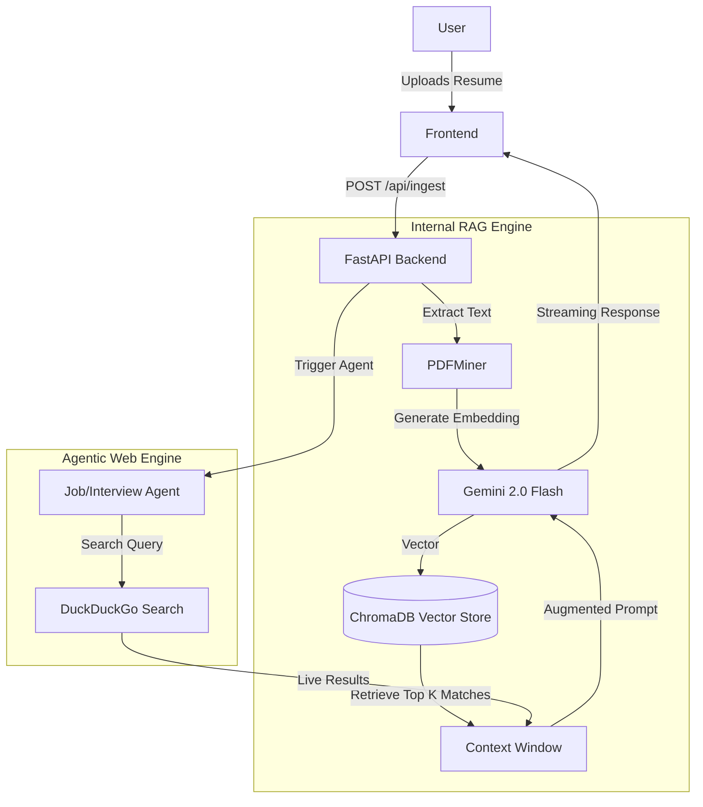

# Career Atlas

**Career Atlas** (formerly Smart Resume AI) is a production-grade **Candidate Optimization Platform** & **Agentic Research Assistant**.  
It combines a RAG (Retrieval-Augmented Generation) pipeline for deep internal analysis with **autonomous web agents** to provide real-time job market intelligence.

**Status: 🚧 Active Building Phase / Beta**

Powered by **Google Gemini 2.0 Flash**, **ChromaDB**, and **Live Web Search**.

---

## 🚀 Features

### 💎 Quick Essentials (Strategy Tools)
Foundational tools to polish your professional profile using internal benchmarks and logic.
*   **Job Fit Analysis**: Matches your resume against market standards and highlights gaps using **RAG** against a database of 2400+ resumes.
*   **Executive Summary**: Generates a punchy, professional bio for your profile.
*   **Resume Enhancer**: Tailors your resume keywords for a specific target role (e.g., "Product Manager").
*   **Cover Letter**: Drafts a personalized cover letter strategy for a specific job application.

### ⚡ Agentic Deep Research (Live Web)
Autonomous agents that go beyond static data to fetch real-time market insights.
*   **Job Scout**: Scours the live web using **targeted ATS algorithms (Greenhouse, Lever, etc.)**, filtering out spam/aggregators to find verified, direct-apply opportunities.
*   **Agentic Interview Prep**: Researches specific company engineering blogs and fresh 2024/2025 community discussions (Reddit/Blind) to predict technical questions.

### 🧠 Core Intelligence
*   **DeepResearchAgent Architecture**: Dedicated Python agents that autonomously plan, search, and verify web data.
*   **Context Command Center**: Persistently holds your resume context to inform every tool.
*   **Multi-Channel Chat Interface**: Modular Floating Assistant with distinct tool sessions.
*   **Image / OCR Support**: Seamlessly extracts text from **.jpg, .jpeg, and .png** resume images using Gemini Vision.

---

## 🛠 Tech Stack

### Frontend
*   **React 18** (Vite)
*   **Context API** for Global State & Chat History
*   **Lucide React** for Modern Iconography
*   **CSS Modules**: Custom "Glassmorphism" Design System
    *   *Theme 1: Shining Cyber Blue (Essentials)*
    *   *Theme 2: Emerald Power (Agentic Tools)*

### Backend
*   **FastAPI** (Python 3.10+)
*   **ChromaDB** (Vector Database - for Resume Benchmarking)
*   **Google Gemini API** (LLM - Gemini 2.0 Flash)
*   **DuckDuckGo Search** (Web Tools for Agentic Workflows)
*   **PDFMiner** (Text Extraction)

---

## 📂 Project Structure

```bash
career-atlas/
├── app/                        # Backend (FastAPI)
│   ├── api/                    # API Routes tailored for each agent
│   │   ├── routes/             # Endpoints (job_fit, interview, web_agents, etc.)
│   ├── core/                   # Config & Settings
│   ├── generation/             # Gemini LLM Clients & Agent Instructions
│   ├── ingestion/              # Data Processing Pipeline
│   ├── services/               # Agentic Services (job_scout, market_research)
│   └── main.py                 # App Entrypoint
├── data/                       # Dataset Storage
├── frontend/                   # Frontend (React)
│   ├── src/
│   │   ├── components/         # Chat Interfaces & UI Cards
│   │   ├── context/            # ChatContext (Message Routing)
│   │   ├── pages/              # Workbench (Main Dashboard)
│   │   └── services/           # API Client
└── scripts/                    # Utility Scripts
```

---

## 🏗 Architecture

### RAG & Agentic Pipeline
The system uses a dual-engine approach: **Internal Knowledge (RAG)** for benchmarking and **External Knowledge (Agents)** for market data.



---

## ⚡ Setup & Installation

### 1. Prerequisites
*   Python 3.10+
*   Node.js 18+
*   Google Gemini API Key
*   ChromaDB Credentials (Optional, defaults to local if not configured)

### 2. Environment Variables
Create a `.env` file in the root directory:

```ini
GEMINI_API_KEY=your_key_here
LOG_LEVEL=INFO

# Optional: Cloud Vector DB
CHROMA_API_KEY=your_chroma_key
CHROMA_TENANT=default_tenant
CHROMA_DATABASE=default_database
```

### 3. Backend Setup
```bash
# Install dependencies
pip install -r requirements.txt

# (Optional) Ingest Seed Data for RAG
python scripts/ingest_data.py
```

### 4. Frontend Setup
```bash
cd frontend
npm install
```

---

## 🏃‍♂️ Running the Application

### Start Backend
```bash
uvicorn app.main:app --reload --port 8000
```
*API Docs available at: http://localhost:8000/docs*

### Start Frontend
```bash
cd frontend
npm run dev
```
*App running at: http://localhost:5173*

---

## 🔗 API Reference

| Method | Endpoint | Description |
| :--- | :--- | :--- |
| `POST` | `/api/parse/resume` | Ingest PDF/Text resume |
| `POST` | `/api/job-fit` | RAG-based Fit Analysis |
| `POST` | `/api/interview/agentic` | **Live Web** Interview Research |
| `POST` | `/api/find-jobs` | **Live Web** Job Search Agent |
| `POST` | `/api/enhance` | Resume Enhancement |
| `POST` | `/api/cover-letter` | Cover Letter Draft |
| `POST` | `/api/ai-assistant/chat` | **Career Atlas** General Assistant |
